2장
================

 

chapter 2
---------

 

#### <프로그램 2-1>

``` r
# 원그래프 그리기

혈액형 = c("A", "B", "B", "A", "A", "O", "A", "AB", "O", "O", 
        "O", "A", "A", "B", "AB", "A", "O", "B", "A", "B", 
        "B", "A", "B", "A", "B", "AB", "B", "A", "O", "AB", 
        "O", "B", "A", "B", "A", "O", "B", "A", "A", "A",
        "A", "O", "A", "O", "O", "B", "B", "O", "AB", "A",
        "B", "AB", "B", "O", "O", "O", "AB", "O", "O", "B", 
        "A", "A", "O", "A", "B", "O", "A", "O", "B", "O",
        "A", "B", "O", "AB", "B", "B", "A", "O", "B", "A",
        "B", "B", "O", "AB", "B", "A", "AB", "A", "B", "A",
        "A", "O", "O", "A", "A", "O", "AB", "A", "A", "O")

혈액형
```

    ##   [1] "A"  "B"  "B"  "A"  "A"  "O"  "A"  "AB" "O"  "O"  "O"  "A"  "A"  "B" 
    ##  [15] "AB" "A"  "O"  "B"  "A"  "B"  "B"  "A"  "B"  "A"  "B"  "AB" "B"  "A" 
    ##  [29] "O"  "AB" "O"  "B"  "A"  "B"  "A"  "O"  "B"  "A"  "A"  "A"  "A"  "O" 
    ##  [43] "A"  "O"  "O"  "B"  "B"  "O"  "AB" "A"  "B"  "AB" "B"  "O"  "O"  "O" 
    ##  [57] "AB" "O"  "O"  "B"  "A"  "A"  "O"  "A"  "B"  "O"  "A"  "O"  "B"  "O" 
    ##  [71] "A"  "B"  "O"  "AB" "B"  "B"  "A"  "O"  "B"  "A"  "B"  "B"  "O"  "AB"
    ##  [85] "B"  "A"  "AB" "A"  "B"  "A"  "A"  "O"  "O"  "A"  "A"  "O"  "AB" "A" 
    ##  [99] "A"  "O"

``` r
정렬.혈액형 = sort(table(혈액형), decreasing = T)
정렬.혈액형
```

    ## 혈액형
    ##  A  O  B AB 
    ## 34 28 27 11

``` r
slices = c("red", "blue", "yellow", "green")
pie(정렬.혈액형, col=slices, radius=1, main="원그래프")
```

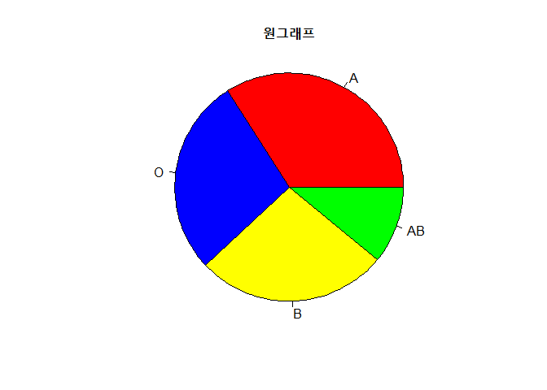

 

#### <프로그램 2-2>, <프로그램 2-3>

``` r
# 원그래프 그리기
require(grDevices)
pie.vote <- c(0.5067, 0.0167, 0.0100, 0.0433, 0.4233)
names(pie.vote) <- c("새누리 152명", "선진 5명", "무 3명", "진보 13명", "민주 127명")
par(mfrow=c(1,2))
pie(pie.vote, col=c("red3", "blue", "green3", "magenta", "yellow"), 
    main="19대 국회의원 선거")

pie(pie.vote, col=c("red3", "blue", "green3", "magenta", "yellow"), 
    main="19대 국회의원 선거")
par(new=TRUE)
pie(c(152, 127, 13, 5, 3), radius = 0.5, col="white", label=NA, border=NA)
text(0,0,"총 300석")
```

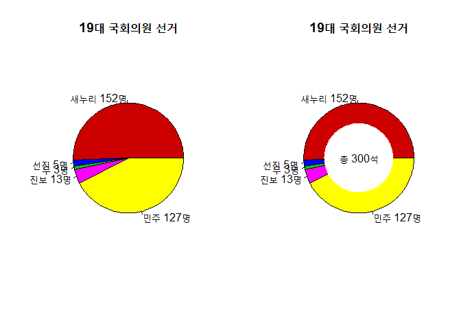

 

#### <프로그램 2-4>

``` r
# 자료입력
혈액형 = c("A", "B", "B", "A", "A", "O", "A", "AB", "O", "O", 
        "O", "A", "A", "B", "AB", "A", "O", "B", "A", "B", 
        "B", "A", "B", "A", "B", "AB", "B", "A", "O", "AB", 
        "O", "B", "A", "B", "A", "O", "B", "A", "A", "A",
        "A", "O", "A", "O", "O", "B", "B", "O", "AB", "A",
        "B", "AB", "B", "O", "O", "O", "AB", "O", "O", "B", 
        "A", "A", "O", "A", "B", "O", "A", "O", "B", "O",
        "A", "B", "O", "AB", "B", "B", "A", "O", "B", "A",
        "B", "B", "O", "AB", "B", "A", "AB", "A", "B", "A",
        "A", "O", "O", "A", "A", "O", "AB", "A", "A", "O")

혈액형
```

    ##   [1] "A"  "B"  "B"  "A"  "A"  "O"  "A"  "AB" "O"  "O"  "O"  "A"  "A"  "B" 
    ##  [15] "AB" "A"  "O"  "B"  "A"  "B"  "B"  "A"  "B"  "A"  "B"  "AB" "B"  "A" 
    ##  [29] "O"  "AB" "O"  "B"  "A"  "B"  "A"  "O"  "B"  "A"  "A"  "A"  "A"  "O" 
    ##  [43] "A"  "O"  "O"  "B"  "B"  "O"  "AB" "A"  "B"  "AB" "B"  "O"  "O"  "O" 
    ##  [57] "AB" "O"  "O"  "B"  "A"  "A"  "O"  "A"  "B"  "O"  "A"  "O"  "B"  "O" 
    ##  [71] "A"  "B"  "O"  "AB" "B"  "B"  "A"  "O"  "B"  "A"  "B"  "B"  "O"  "AB"
    ##  [85] "B"  "A"  "AB" "A"  "B"  "A"  "A"  "O"  "O"  "A"  "A"  "O"  "AB" "A" 
    ##  [99] "A"  "O"

``` r
정렬.혈액형 = sort(table(혈액형), decreasing = T)
정렬.혈액형
```

    ## 혈액형
    ##  A  O  B AB 
    ## 34 28 27 11

``` r
slices = c("red", "blue", "yellow", "green")

# 막대그래프 그리기 
barplot(정렬.혈액형, col=slices, main="혈액형별 막대그래프")
```

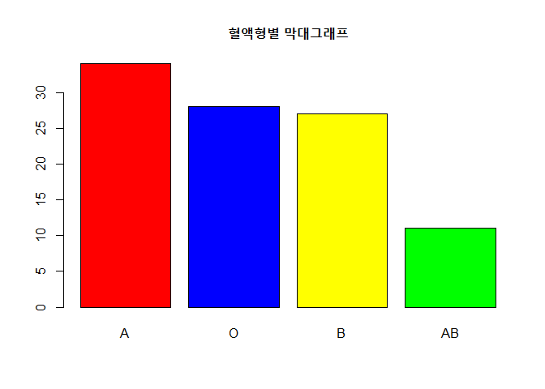

 

#### <프로그램 2-5>

``` r
# 막대그래프 그리기
require(grDevices)
pie.vote <- c(0.5067, 0.0167, 0.0100, 0.0433, 0.4233)
names(pie.vote) <- c("새누리 152명", "선진 5명", "무 3명", "진보 13명", "민주 127명")

barplot(pie.vote, col=c("red3", "blue", "green3", "magenta", "yellow"), 
        main="정당별 막대그래프")
```

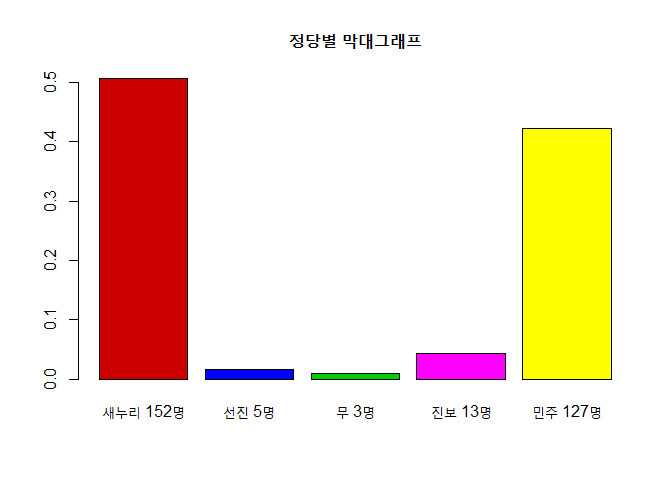

 

#### <프로그램 2-6>

 

#### class1에 대한 언급이 없다.

    # 외부 파일을 읽어 데이터 프레임 만들기
    담즙과포화비율 = read.table("담즙과포화비율.txt", header=T)
    담즙과포화비율

    attach(담즙과포화비율)
    str(담즙과포화비율)

    # 담즙과포화비율 - 자료의 크기
    n = length(담즙의과포화비율)
    n

    # 담즙과포화비율 - 자료의 정렬
    sort(담즙의과포화비율)
    sort(담즙의과포화비율, decreasing = T)

    # 담즙과포화비율 히스토그램과 개별 자료
    par(mfrow=c(2,1))
    hist(담즙의과포화비율, breaks=class1, main=NULL)
    rug(jitter(담즙의과포화비율))
    hist(담즙의과포화비율, breaks=class1, right=F, main=NULL)
    rug(jitter(담즙의과포화비율))

 

#### <프로그램 2-7>

 

#### class1에 대한 언급 필요

    # 담즙과포화비율 히스토그램과 개별 자료
    par(mfrow=c(2,1))
    hist(담즙의과포화비율, breaks=class1, main=NULL)
    rug(jitter(담즙의과포화비율))
    hist(담즙의과포화비율, breaks=class1, right=F, main=NULL)
    rug(jitter(담즙의과포화비율))

    # 상대도수밀도히스토그램, 커털밀도추정량과 개별 자료
    m = matrix(c(1,3,2,3), ncol=2, byrow=T)
    layout(mat=m)
    hist(답즙의과포화비율, prob=T, breaks=class1, right=F, ylab="상대도수", main=NULL)
    lines(density(답즙의과포화비율, bw=5), col="red")
    rug(담즙의과포화비율, col="blue")

 

#### <프로그램 2-8>

``` r
require(stats)
data("faithful")

eruption.length <- faithful$eruptions

# 원자료의 크기
n = length(eruption.length)
n
```

    ## [1] 272

``` r
# 원자료의 범위
range(eruption.length)
```

    ## [1] 1.6 5.1

``` r
# 원자료에 대한 정렬
sort(eruption.length)
```

    ##   [1] 1.600 1.667 1.700 1.733 1.750 1.750 1.750 1.750 1.750 1.750 1.783
    ##  [12] 1.783 1.800 1.800 1.800 1.800 1.817 1.817 1.817 1.833 1.833 1.833
    ##  [23] 1.833 1.833 1.833 1.833 1.850 1.850 1.867 1.867 1.867 1.867 1.867
    ##  [34] 1.867 1.867 1.867 1.883 1.883 1.883 1.883 1.917 1.917 1.933 1.933
    ##  [45] 1.950 1.967 1.967 1.967 1.983 1.983 1.983 2.000 2.000 2.000 2.000
    ##  [56] 2.017 2.017 2.017 2.033 2.033 2.067 2.083 2.083 2.100 2.100 2.100
    ##  [67] 2.133 2.150 2.167 2.167 2.183 2.200 2.200 2.200 2.217 2.233 2.233
    ##  [78] 2.250 2.250 2.267 2.283 2.300 2.317 2.333 2.350 2.367 2.383 2.400
    ##  [89] 2.400 2.417 2.417 2.483 2.617 2.633 2.800 2.883 2.900 3.067 3.317
    ## [100] 3.333 3.333 3.367 3.417 3.450 3.500 3.500 3.567 3.567 3.600 3.600
    ## [111] 3.600 3.600 3.683 3.717 3.733 3.750 3.767 3.767 3.817 3.833 3.833
    ## [122] 3.833 3.833 3.833 3.850 3.850 3.883 3.917 3.917 3.917 3.950 3.950
    ## [133] 3.966 3.967 4.000 4.000 4.000 4.000 4.000 4.000 4.033 4.033 4.050
    ## [144] 4.067 4.067 4.083 4.083 4.083 4.083 4.083 4.100 4.100 4.117 4.117
    ## [155] 4.133 4.133 4.150 4.150 4.150 4.150 4.167 4.167 4.167 4.167 4.183
    ## [166] 4.200 4.233 4.233 4.233 4.250 4.250 4.250 4.250 4.267 4.267 4.283
    ## [177] 4.283 4.300 4.300 4.317 4.333 4.333 4.333 4.333 4.333 4.350 4.350
    ## [188] 4.350 4.350 4.366 4.367 4.367 4.367 4.383 4.400 4.417 4.417 4.417
    ## [199] 4.417 4.433 4.433 4.450 4.450 4.450 4.467 4.467 4.483 4.500 4.500
    ## [210] 4.500 4.500 4.500 4.500 4.500 4.500 4.517 4.533 4.533 4.533 4.533
    ## [221] 4.533 4.550 4.567 4.567 4.567 4.583 4.583 4.583 4.583 4.600 4.600
    ## [232] 4.600 4.600 4.617 4.633 4.633 4.633 4.650 4.667 4.667 4.700 4.700
    ## [243] 4.700 4.700 4.700 4.700 4.716 4.733 4.750 4.767 4.783 4.800 4.800
    ## [254] 4.800 4.800 4.800 4.800 4.817 4.817 4.833 4.833 4.850 4.883 4.900
    ## [265] 4.900 4.933 4.933 4.933 5.000 5.033 5.067 5.100

``` r
# 원자료에 대한 평균과 분산
mean(eruption.length)
```

    ## [1] 3.487783

``` r
var(eruption.length)
```

    ## [1] 1.302728

``` r
class1 = seq(1.6, 5.1, by=0.5)
class2 = seq(1.85, 4.85, by=0.5)


# 계급의 폭을 0.5로 하고 제1계급의 하한값(원점이라고도 함)을 1.6으로 하는 도수분포표
cat.class1 = cut(eruption.length, breaks=class1)
t1 = table(cat.class1)
t1
```

    ## cat.class1
    ## (1.6,2.1] (2.1,2.6] (2.6,3.1] (3.1,3.6] (3.6,4.1] (4.1,4.6] (4.6,5.1] 
    ##        65        26         6        14        40        81        39

``` r
# 계급의 폭을 0.5로 하고 제1계급의 하한값(원점이라고도 함)을 1.85으로 하는 도수분포표
cat.class2 = cut(eruption.length, breaks=class2)
t2 = table(cat.class2)
t2
```

    ## cat.class2
    ## (1.85,2.35] (2.35,2.85] (2.85,3.35] (3.35,3.85] (3.85,4.35] (4.35,4.85] 
    ##          57          10           6          25          63          73

``` r
# class1 도수분포표를 이용하여 구하는 평균과 분산
m1 = (class1 + 0.25)[-length(class1)]
f1 = as.vector(t1)

mean1 = sum(m1*f1)/sum(f1)
mean1
```

    ## [1] 3.471771

``` r
var1 = sum((m1-mean1)^2*f1)/sum(f1)
var1
```

    ## [1] 1.28591

``` r
# class2 도수분포표를 이용하여 구하는 평균과 분산
m2 = (class2 + 0.25)[-length(class2)]
f2 = as.vector(t2)

mean2 = sum(m2*f2)/sum(f2)
mean2
```

    ## [1] 3.625641

``` r
var2 = sum((m2-mean2)^2*f2)/sum(f2)
var2
```

    ## [1] 0.9758383

``` r
# 히스토그램
class1 = class1
class2 = c(1.35, class2, 5.35)
par(mfrow=c(1,2))
hist(eruption.length, breaks=class1, main="간헐온천 지속시간에 대한 히스토그램 \n origin : 1.6", 
     xlab="간헐온천 지속시간")

hist(eruption.length, breaks=class2, main="간헐온천 지속시간에 대한 히스토그램 \n origin : 1.85", 
     xlab="간헐온천 지속시간")
```

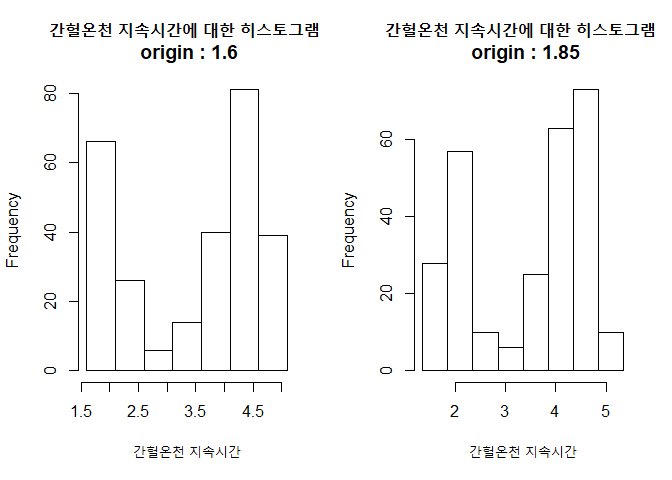

 

#### <프로그램 2-9>

``` r
# 각각 제1계급의 하한값을 1.6과 1.85로 하는 히스토그램에서 계급의 폭 변동하기

hist.func2 = function(n){
  par(mfrow=c(n,2))
  for(i in 1:n){
    class1 = seq(1.1, 5.1, by=0.5/(2*i - 1))
    class2 = seq(1.35, 5.35, by=0.5/(2*i - 1))
    hist(eruption.length, breaks=class1, prob=T, main="origin:1.6", xlab=NULL)
    hist(eruption.length, breaks=class2, prob=T, main="origin:1.85", xlab=NULL)
  }
}

hist.func2(3)
```

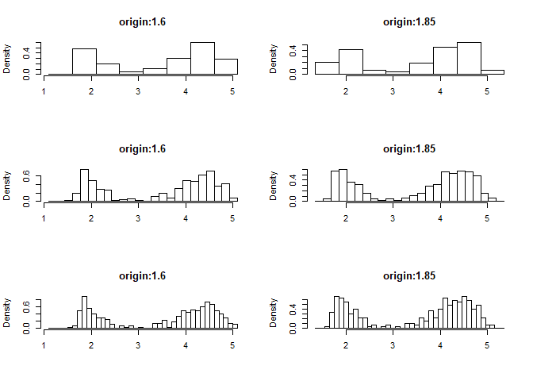

``` r
# 도수분포표(계급의 폭 : 0.1, 0.2, 0.3, 0.4, 0.5)
w = c(0.1, 0.2, 0.3, 0.4, 0.5)
for(i in 1:5){
  class1 = seq(1.1, 5.5, by=w[i])
  cat.class1 = cut(eruption.length, breaks = class1)
  table(cat.class1)
  cat("계급의 폭 = ", w[i], "\n")
  print(table(cat.class1))
}
```

    ## 계급의 폭 =  0.1 
    ## cat.class1
    ## (1.1,1.2] (1.2,1.3] (1.3,1.4] (1.4,1.5] (1.5,1.6] (1.6,1.7] (1.7,1.8] 
    ##         0         0         0         0         1         2        13 
    ## (1.8,1.9]   (1.9,2]   (2,2.1] (2.1,2.2] (2.2,2.3] (2.3,2.4] (2.4,2.5] 
    ##        24        15        11         8         8         7         3 
    ## (2.5,2.6] (2.6,2.7] (2.7,2.8] (2.8,2.9]   (2.9,3]   (3,3.1] (3.1,3.2] 
    ##         0         2         1         2         0         1         0 
    ## (3.2,3.3] (3.3,3.4] (3.4,3.5] (3.5,3.6] (3.6,3.7] (3.7,3.8] (3.8,3.9] 
    ##         0         4         4         6         1         5         9 
    ##   (3.9,4]   (4,4.1] (4.1,4.2] (4.2,4.3] (4.3,4.4] (4.4,4.5] (4.5,4.6] 
    ##        13        12        14        13        16        20        18 
    ## (4.6,4.7] (4.7,4.8] (4.8,4.9]   (4.9,5]   (5,5.1] (5.1,5.2] (5.2,5.3] 
    ##        13        11         8         4         3         0         0 
    ## (5.3,5.4] (5.4,5.5] 
    ##         0         0 
    ## 계급의 폭 =  0.2 
    ## cat.class1
    ## (1.1,1.3] (1.3,1.5] (1.5,1.7] (1.7,1.9] (1.9,2.1] (2.1,2.3] (2.3,2.5] 
    ##         0         0         3        37        26        16        10 
    ## (2.5,2.7] (2.7,2.9] (2.9,3.1] (3.1,3.3] (3.3,3.5] (3.5,3.7] (3.7,3.9] 
    ##         2         3         1         0         8         7        14 
    ## (3.9,4.1] (4.1,4.3] (4.3,4.5] (4.5,4.7] (4.7,4.9] (4.9,5.1] (5.1,5.3] 
    ##        25        27        36        31        19         7         0 
    ## (5.3,5.5] 
    ##         0 
    ## 계급의 폭 =  0.3 
    ## cat.class1
    ## (1.1,1.4] (1.4,1.7]   (1.7,2]   (2,2.3] (2.3,2.6] (2.6,2.9] (2.9,3.2] 
    ##         0         3        52        27        10         5         1 
    ## (3.2,3.5] (3.5,3.8] (3.8,4.1] (4.1,4.4] (4.4,4.7]   (4.7,5]   (5,5.3] 
    ##         8        12        34        43        45        29         3 
    ## 계급의 폭 =  0.4 
    ## cat.class1
    ## (1.1,1.5] (1.5,1.9] (1.9,2.3] (2.3,2.7] (2.7,3.1] (3.1,3.5] (3.5,3.9] 
    ##         0        40        42        12         4         8        21 
    ## (3.9,4.3] (4.3,4.7] (4.7,5.1] (5.1,5.5] 
    ##        52        67        26         0 
    ## 계급의 폭 =  0.5 
    ## cat.class1
    ## (1.1,1.6] (1.6,2.1] (2.1,2.6] (2.6,3.1] (3.1,3.6] (3.6,4.1] (4.1,4.6] 
    ##         1        65        26         6        14        40        81 
    ## (4.6,5.1] 
    ##        39

 

#### <프로그램 2-10>

    # 임의의 수 생성
    runif(n, min, max)

``` r
# 균일분포로부터 난수생성 자료의 분포 히스토그램
x <- runif(400, -1, 1)
hist(x)
```

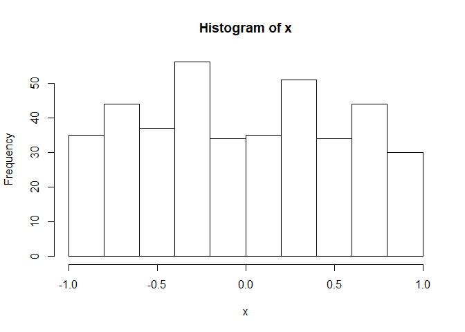

 

#### <프로그램 2-11>

    # 정규분포로부터의 임의의 수 생성
    rnorm(n, mean, sd)

 

#### <프로그램 2-12>

``` r
# 정규분포로부터 난수생성 자료의 분포 히스토그램
x <- rnorm(400)
hist(x)
```

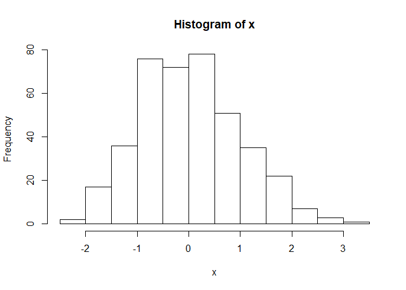

 

#### <프로그램 2-13>

    # 이항분포 임의의 수 생성
    rbinom(n, size, prob)

 

#### <프로그램 2-14>

    # 포아송분포 임의의 수 생성
    rpois(n lambda)

 

#### <프로그램 2-15>

``` r
# 이항분포로부터 난수생성 자료의 분포 히스토그램
z <- rbinom(1000, 10, 0.5)
table(z)
```

    ## z
    ##   1   2   3   4   5   6   7   8   9  10 
    ##  12  52 111 210 222 220 118  46   8   1

``` r
hist(z)
```

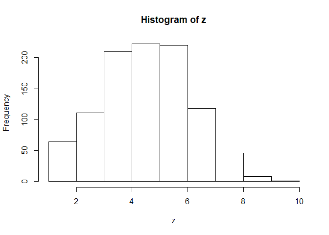

``` r
# 포아송분포로부터 난수생성 자료의 분포 히스토그램
z <- rpois(1000, 5)
table(z)
```

    ## z
    ##   0   1   2   3   4   5   6   7   8   9  10  11  12 
    ##   4  37  77 152 167 167 137 129  63  38  20   6   3

``` r
hist(z)
```

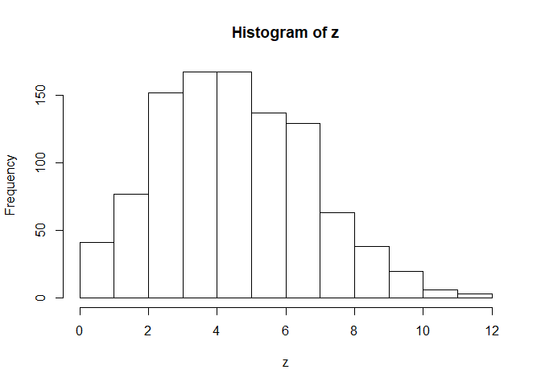

 

#### <프로그램 2-16>

``` r
# 상자그림 작성
boxplot(담즙의과포화비율, col="yellow", horizontal=T, main=NULL)
rug(담즙의과포화비율, col="blue")
```

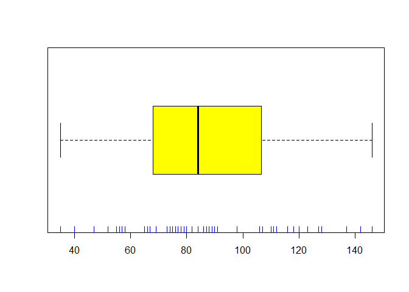

 

#### <프로그램 2-17>

``` r
# 상자그림과 바이올린그림

# install.packages("vioplot")
require(vioplot)
par(mfrow=c(1,2))
boxplot(담즙의과포화비율 ~ 성별, notch=T, col="yellow", main=NULL)
male <- 담즙과포화비율$담즙의과포화비율[담즙과포화비율$성별=="남자"]
female <- 담즙과포화비율$담즙의과포화비율[담즙과포화비율$성별=="여자"]
vioplot(male, female)
```

    ## [1]  35 146

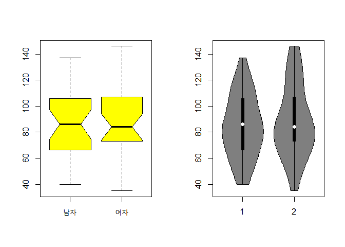

 

#### <프로그램 2-18>

 

#### 수정이 필요합니다.

``` r
# 외부파일 읽어 상자그림 작성
국회의원 = read.csv("국회의원_선거구_유권자_수.csv", header=T)
attach(국회의원)
str(국회의원)
```

    ## 'data.frame':    245 obs. of  5 variables:
    ##  $ 시도      : Factor w/ 16 levels "강원","경기",..: 9 9 9 9 9 9 9 9 9 9 ...
    ##  $ 시도번호  : int  1 1 1 1 1 1 1 1 1 1 ...
    ##  $ 선거구명  : Factor w/ 232 levels "강남구갑","강남구을",..: 193 194 169 125 126 31 32 74 75 198 ...
    ##  $ 선거구번호: int  1 2 3 4 5 6 7 8 9 10 ...
    ##  $ 선거인.수 : int  135727 106880 192033 143798 121869 145896 152770 159626 144162 161923 ...

``` r
boxplot(선거인.수, col="yellow", horizontal = T, main=NULL)
```

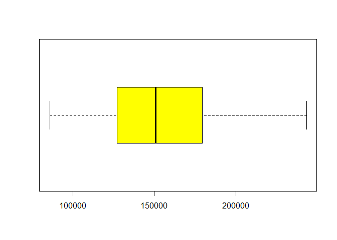

 

#### <프로그램 2-19>

``` r
electorate <- read.csv("국회의원_선거구_유권자_수.csv", header=T)
str(electorate); attach(electorate)
```

    ## 'data.frame':    245 obs. of  5 variables:
    ##  $ 시도      : Factor w/ 16 levels "강원","경기",..: 9 9 9 9 9 9 9 9 9 9 ...
    ##  $ 시도번호  : int  1 1 1 1 1 1 1 1 1 1 ...
    ##  $ 선거구명  : Factor w/ 232 levels "강남구갑","강남구을",..: 193 194 169 125 126 31 32 74 75 198 ...
    ##  $ 선거구번호: int  1 2 3 4 5 6 7 8 9 10 ...
    ##  $ 선거인.수 : int  135727 106880 192033 143798 121869 145896 152770 159626 144162 161923 ...

``` r
summary(선거인.수)
```

    ##    Min. 1st Qu.  Median    Mean 3rd Qu.    Max. 
    ##   85779  126970  150961  154270  179354  243349

``` r
boxplot(선거인.수, col="yellow", ylim=c(0,250000), ylab="전국", xlab="선거인.수", horizontal = T)
```

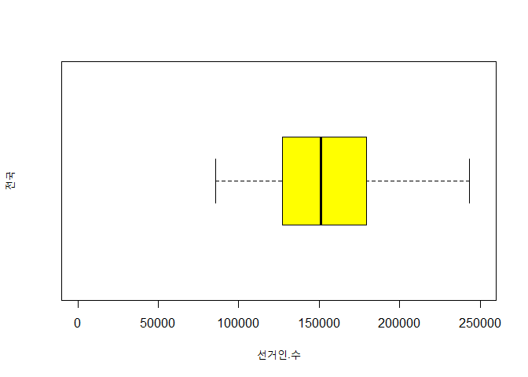

``` r
시도.순서 <- reorder(시도, 시도번호)
bp <- boxplot(선거인.수 ~ 시도.순서)
```

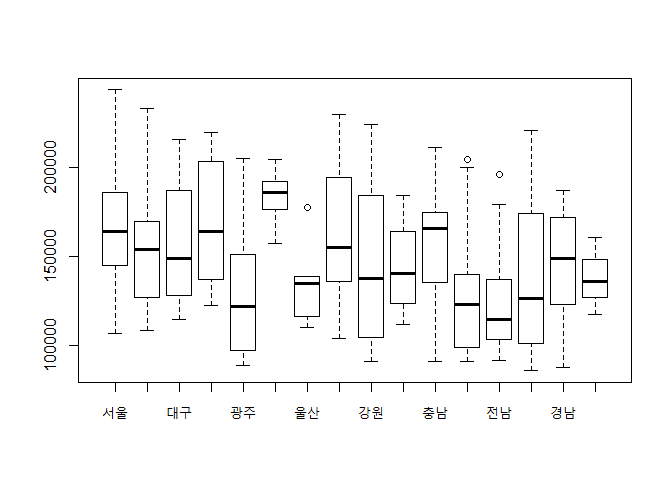

``` r
order <- rank(-bp$stats[3,])
boxplot(선거인.수 ~ 시도.순서, col=heat.colors(16)[order], ylim=c(0,250000), ylab="선거인.수",
           main="우리나라 18대 국회의원 선거구의 선거인 수 분포")
```

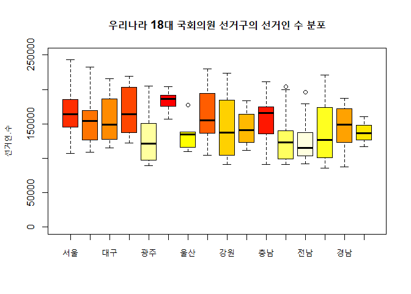

 

#### <프로그램 2-20>

``` r
exam1 <- read.table("exam1.txt", header=T)
str(exam1)
```

    ## 'data.frame':    65 obs. of  2 variables:
    ##  $ hw   : int  0 0 1 0 1 1 1 1 1 0 ...
    ##  $ score: int  54 51 52 82 37 41 41 46 46 29 ...

``` r
attach(exam1)
stem(score)
```

    ## 
    ##   The decimal point is 1 digit(s) to the right of the |
    ## 
    ##   0 | 00
    ##   1 | 058
    ##   2 | 1333458889
    ##   3 | 0355789
    ##   4 | 11133456678
    ##   5 | 11122233344456688
    ##   6 | 147779
    ##   7 | 33478
    ##   8 | 29
    ##   9 | 09

``` r
stem(score, scale=2)
```

    ## 
    ##   The decimal point is 1 digit(s) to the right of the |
    ## 
    ##   0 | 00
    ##   0 | 
    ##   1 | 0
    ##   1 | 58
    ##   2 | 13334
    ##   2 | 58889
    ##   3 | 03
    ##   3 | 55789
    ##   4 | 111334
    ##   4 | 56678
    ##   5 | 111222333444
    ##   5 | 56688
    ##   6 | 14
    ##   6 | 7779
    ##   7 | 334
    ##   7 | 78
    ##   8 | 2
    ##   8 | 9
    ##   9 | 0
    ##   9 | 9
