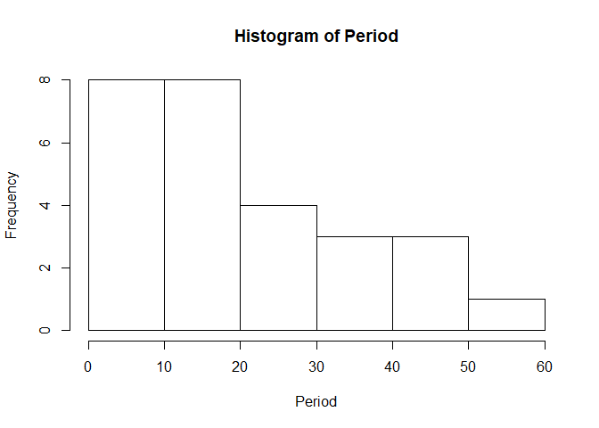
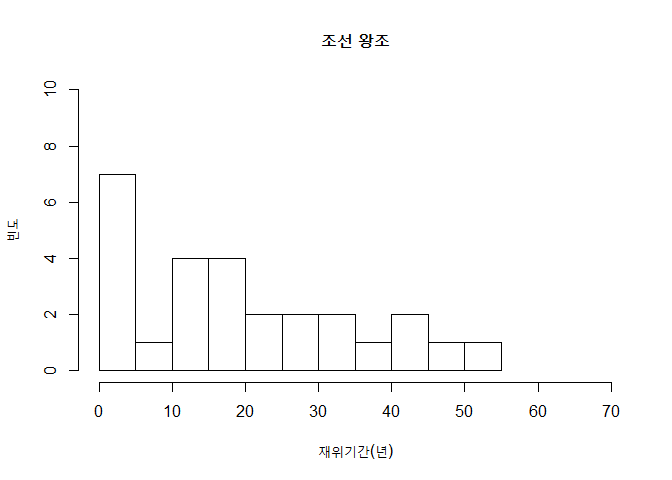
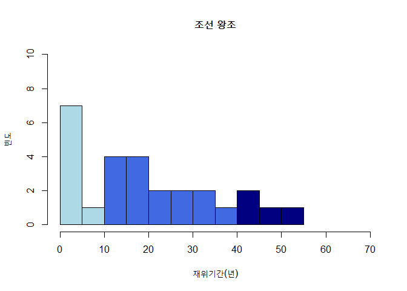
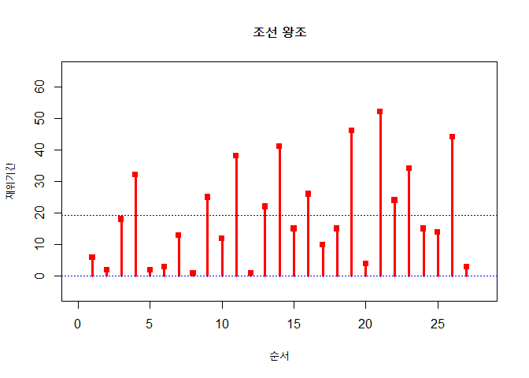
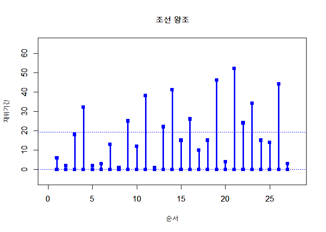
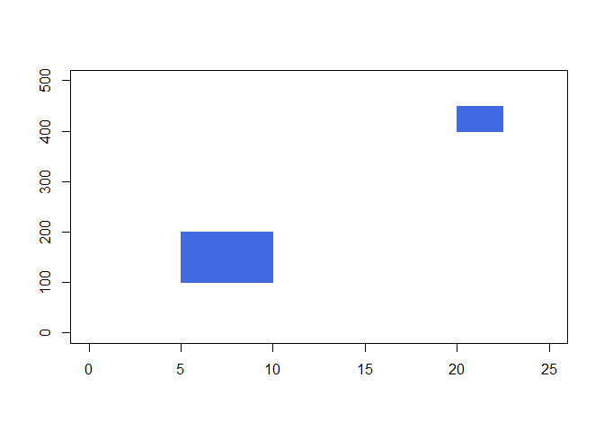
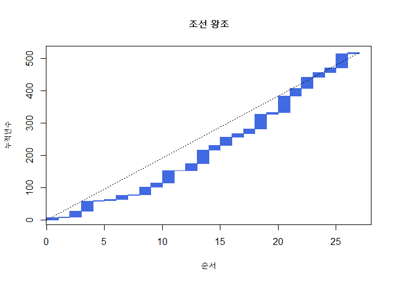
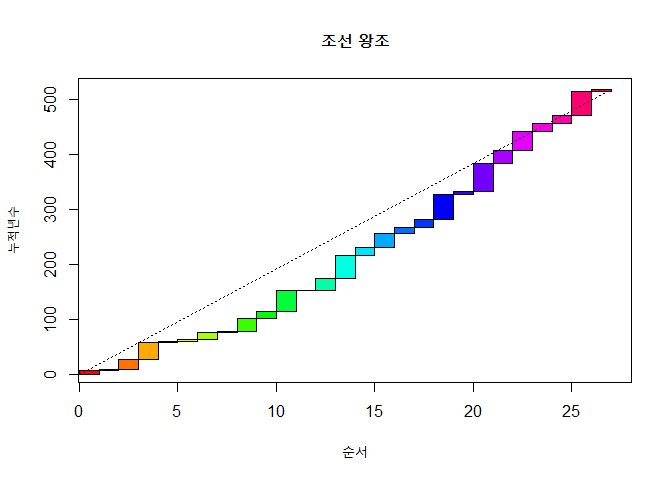

1장
================

Chapter 1
---------

 

``` r
kings <- read.table("chosun_kings.txt", header=T)
str(kings)
```

    ## 'data.frame':    27 obs. of  3 variables:
    ##  $ Name  : Factor w/ 27 levels "경종","고종",..: 23 20 24 10 6 4 9 16 8 14 ...
    ##  $ Life  : int  73 62 45 53 38 16 51 28 37 30 ...
    ##  $ Period: int  6 2 18 32 2 3 13 1 25 12 ...

``` r
head(kings)
```

    ##   Name Life Period
    ## 1 태조   73      6
    ## 2 정종   62      2
    ## 3 태종   45     18
    ## 4 세종   53     32
    ## 5 문종   38      2
    ## 6 단종   16      3

``` r
attach(kings)
median(Life)
```

    ## [1] 45

``` r
median(Period)
```

    ## [1] 15

 

``` r
hist(Period, right=F) 
```



``` r
# savePlot("figure 3.png", type="png")
hist(Period, xlim=c(0,70), ylim=c(0,10), nclass=14, right=F, main="조선 왕조", xlab="재위기간(년)", ylab="빈도")
```



``` r
# savePlot("figure 4.png", type="png")
hist(Period, xlim=c(0,70), ylim=c(0,10), nclass=14, right=F, main="조선 왕조", xlab="재위기간(년)", ylab="빈도", col=c(rep("lightblue",2),rep("royalblue",6),rep("navyblue",6)))
```



``` r
# savePlot("figure 5.png", type="png")
```

``` r
plot(c(0,0),c(28,60),type="n",xlim=c(0,28),ylim=c(-5,65),xlab="순서",ylab="재위기간",main="조선 왕조")
points(1:27,Period,pch=15,col="red")
segments(1:27,rep(0,27),1:27,Period,lwd=3,col="red")
abline(h=c(0,mean(Period)),lty="dotted",lwd=1,col="blue")
```



 

``` r
plot(1:27,Period,pch=15,col="blue",xlim=c(0,28),ylim=c(-5,65),xlab="순서",ylab="재위기간",main="조선 왕조")
par(new=T)
plot(1:27,rep(0,27),pch=15,col="blue",xlim=c(0,28),ylim=c(-5,65),xlab="",ylab="",main="")
abline(h=c(0,mean(Period)),lty="dotted",lwd=1,col="blue")
segments(1:27,rep(0,27),1:27,Period,lwd=3,col="blue")
```



 

``` r
plot(1:27,Period,pch=15,col="blue",xlim=c(0,28),ylim=c(-5,65),xlab="순서",ylab="재위기간",main="조선 왕조")
par(new=T)
plot(1:27,rep(0,27),pch=15,col="blue",xlim=c(0,28),ylim=c(-5,65),xlab="",ylab="",main="")
abline(h=c(0,mean(Period)),lty="dotted",lwd=1,col="blue")
for (i in 1:27) lines(c(i,i),c(0,Period[i]),lwd=3,col="blue")
```


 

``` r
plot(c(0,25),c(0,500),col="blue",type="n",xlab="",ylab="",main="")
rect(5,100,10,200,col="royalblue",border="royalblue")
rect(20,400,22.5,450,col="royalblue",border="royalblue")
```



 

``` r
P <- cumsum(Period)
plot(1:27,P,type="n",xlab="순서",ylab="누적년수",main="조선 왕조")
rect(0,0,1,P[1],col="royalblue",border="royalblue")
for (i in 2:27) rect(i-1,P[i-1],i,P[i],col="royalblue",border="royalblue")
segments(0,0,27,518,lty="dotted")
```



 

``` r
P <- cumsum(Period)
plot(1:27,P,type="n",xlab="순서",ylab="누적년수",main="조선 왕조")
polygon(c(0,0,1,1),c(0,P[1],P[1],0),col=rainbow(27)[1])
for (i in 2:27) polygon(c(i-1,i-1,i,i),c(P[i-1],P[i],P[i],P[i-1]),col=rainbow(27)[i])
segments(0,0,27,518,lty="dotted")
```



 

End
---
